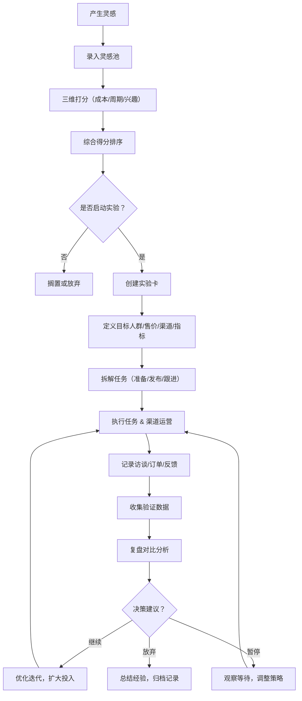
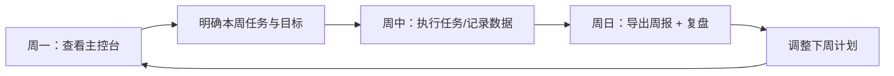

## 1. 产品概述

副业实验室是一款面向上班族的桌面端副业管理工具，帮助用户在下班后系统化地尝试卖资料包、咨询服务、手作小产品等副业项目。通过灵感收集、实验验证、任务追踪、渠道管理、财务记录和复盘分析等全流程功能，让副业探索变得可控、可量化、可持续。

- 目标用户：下班后有时间精力、希望通过副业增加收入的职场人士
- 核心价值：将副业探索从"试试看"转变为"科学实验"，降低试错成本，提高成功率

## 2. 核心功能

### 2.1 用户角色
| 角色 | 注册方式 | 核心权限 |
|------|---------|---------|
| 普通用户 | 本地应用（无需注册） | 使用全部功能，数据本地存储 |

### 2.2 功能模块
1. **主控台**：当前实验概览、收入统计、待办任务、风险提醒
2. **灵感池**：点子收集与管理，按成本/周期/兴趣三维打分排序
3. **实验卡**：实验详情管理，包含目标人群、售价、渠道、验证指标
4. **任务日历**：按准备/发布/跟进阶段拆解任务，日历视图展示
5. **渠道记录页**：发帖记录、投放效果、合作反馈追踪
6. **访谈窗口**：潜在客户访谈记录与问题整理
7. **订单账本**：成交/退款/成本/利润的财务记录与统计
8. **复盘页**：多方案对比分析，智能生成继续/暂停/放弃建议
9. **素材库**：文案、图片、报价单、常用回复管理，支持导出周报

### 2.3 页面详情
| 页面名称 | 模块名称 | 功能描述 |
|---------|---------|---------|
| 主控台 | 统计卡片 | 展示进行中实验数、本月收入、待办数量、风险预警数 |
| 主控台 | 当前实验列表 | 卡片式展示正在进行的实验，显示名称、进度、关键指标 |
| 主控台 | 收入趋势图 | 近30天收入折线图，直观展示收入走势 |
| 主控台 | 今日待办 | 按优先级展示今日任务清单 |
| 主控台 | 风险提醒 | 自动检测超期任务、低转化实验、库存不足等风险 |
| 灵感池 | 打分卡片 | 三维评分（成本1-5、周期1-5、兴趣1-5），自动计算综合得分 |
| 灵感池 | 灵感列表 | 按综合得分排序，支持标签筛选、搜索 |
| 灵感池 | 新建灵感 | 快速录入灵感，填写描述、标签、打分 |
| 灵感池 | 转化实验 | 一键将灵感转化为实验卡 |
| 实验卡 | 实验详情 | 目标人群画像、售价策略、渠道列表、验证指标定义 |
| 实验卡 | 状态管理 | 草稿/进行中/已完成/已暂停/已放弃状态切换 |
| 实验卡 | 里程碑 | 设置关键里程碑节点与完成状态 |
| 任务日历 | 日历视图 | 月/周视图展示任务分布 |
| 任务日历 | 任务阶段 | 准备/发布/跟进三阶段分类管理 |
| 任务日历 | 任务操作 | 创建、编辑、完成、延期任务 |
| 渠道记录页 | 发帖记录 | 记录各平台发帖内容、时间、互动数据 |
| 渠道记录页 | 投放记录 | 广告投放渠道、预算、点击、转化数据 |
| 渠道记录页 | 合作记录 | 合作方、合作内容、反馈结果 |
| 访谈窗口 | 访谈列表 | 按实验分组展示访谈记录 |
| 访谈窗口 | 问题标签 | 高频问题自动聚合标签 |
| 访谈窗口 | 问题统计 | 问题出现频次排序，助力产品优化 |
| 订单账本 | 交易记录 | 成交/退款/成本分类记录 |
| 订单账本 | 利润统计 | 自动计算收入、成本、毛利率 |
| 订单账本 | 实验财务 | 按实验维度统计盈亏 |
| 复盘页 | 多方案对比 | 并排对比多个实验的关键指标 |
| 复盘页 | 智能建议 | 基于数据自动生成继续/暂停/放弃建议 |
| 复盘页 | 复盘笔记 | 文字记录复盘思考与经验教训 |
| 素材库 | 分类管理 | 文案/图片/报价单/常用回复四分类 |
| 素材库 | 标签检索 | 支持标签、关键词搜索素材 |
| 素材库 | 周报导出 | 一键导出本周工作汇总 Word/PDF 报告 |

## 3. 核心流程

### 3.1 副业探索主流程

用户从产生一个副业想法开始，通过打分评估后转化为正式实验，然后拆解任务、运营渠道、记录访谈、跟踪订单，最后进行复盘决策，决定是否继续投入。

### 3.2 每周工作流程

## 4. 用户界面设计

### 4.1 设计风格

**整体风格：工业风实验室主题**

- 主色调：深靛蓝 `#1e3a5f`（专业可信）
- 强调色：琥珀橙 `#f59e0b`（实验温度/警示）、翠绿 `#10b981`（成功/正向）、珊瑚红 `#ef4444`（风险/停止）
- 中性色：石板灰系列（背景、文字、边框）
- 按钮风格：微立体扁平按钮，圆角 8px，hover 有轻微上浮阴影
- 字体：标题使用"思源黑体"粗体，正文使用"思源宋体"/系统无衬线体，数字使用等宽字体增强数据感
- 布局：左侧导航栏 + 主内容区卡片式布局，带有细微实验器皿装饰元素（试管、烧瓶图标点缀）
- 图标：Lucide 线性图标，辅以实验主题 emoji（🧪、📊、💡、📅）
- 数据可视化：使用简单清晰的条形/折线图，带有琥珀橙色渐变
- 装饰元素：实验笔记本纹理背景、手写便签效果卡片、图钉便签装饰

### 4.2 页面设计概览

| 页面名称 | 模块名称 | UI 元素 |
|---------|---------|---------|
| 主控台 | 统计卡片 | 四个 2x2 数据卡片，图标 + 数值 + 环比变化，琥珀橙点缀边框 |
| 主控台 | 当前实验列表 | 横向卡片排列，进度条、状态徽章、关键指标迷你图 |
| 主控台 | 收入趋势图 | 琥珀橙折线渐变图，X轴日期 Y轴金额 |
| 主控台 | 待办/风险 | 左右两栏，待办勾选列表 + 红色警示卡片 |
| 灵感池 | 打分卡片 | 三色进度条（成本红/周期蓝/兴趣绿），综合得分圆形进度环 |
| 灵感池 | 灵感列表 | 瀑布流卡片，标签徽章，悬停浮起 |
| 实验卡 | 实验详情 | 分栏布局：左侧基本信息，右侧指标追踪，顶部状态丝带 |
| 任务日历 | 日历视图 | 月历格子，任务彩色圆点标记，右侧任务详情面板 |
| 渠道记录页 | 记录列表 | 时间轴布局，平台图标，互动数据迷你柱状图 |
| 访谈窗口 | 问题墙 | 标签云 + 卡片列表，问题频次热力色阶 |
| 订单账本 | 财务概览 | 收入/成本/利润三大数字，下方交易表格 |
| 复盘页 | 对比表 | 多列并排对比，关键指标差异高亮，建议卡片边框色区分 |
| 素材库 | 素材网格 | 4类图标分类，悬停放大，标签过滤条 |

### 4.3 响应式设计

- 设计方式：桌面端优先（默认 1440px 宽度）
- 侧边栏：在 <1024px 时折叠为图标栏，<768px 时变为底部 Tab 栏
- 卡片布局：大屏幕 3-4 列，中屏幕 2 列，小屏幕 1 列堆叠
- 表格：小屏幕时转为卡片式列表展示
- 交互：桌面端 hover 效果丰富，移动端替换为点击交互

### 4.4 数据持久化

- 使用 localStorage 存储所有用户数据（灵感、实验、任务、订单等）
- 提供数据导出/导入 JSON 功能，方便备份迁移
- 周报导出为 Markdown 格式，可直接复制或打印
