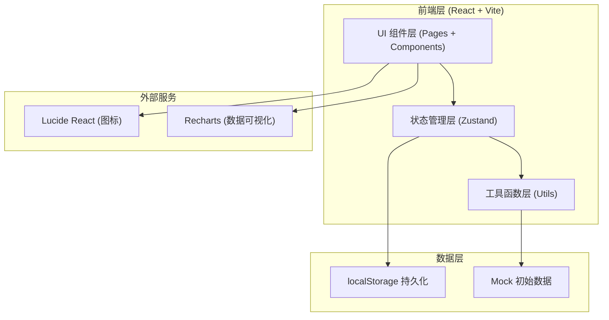
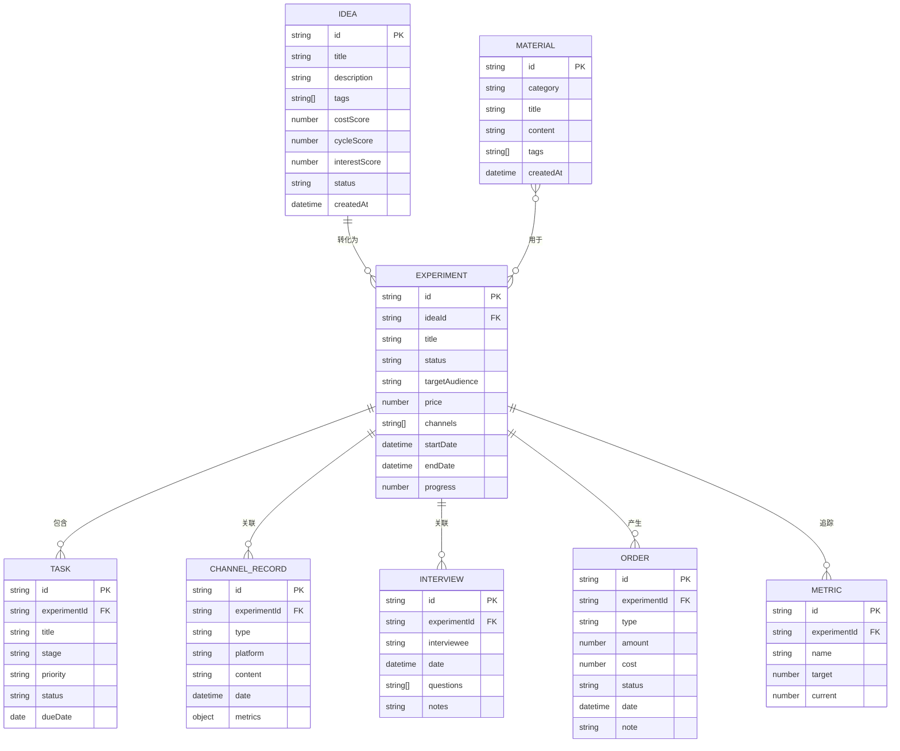

## 1. 架构设计



## 2. 技术描述

- **前端框架**：React@18 + TypeScript@5
- **构建工具**：Vite@5
- **路由管理**：react-router-dom@6
- **状态管理**：zustand@4（轻量级，支持 localStorage 持久化中间件）
- **样式方案**：Tailwind CSS@3（原子化 CSS，快速构建实验室风格 UI）
- **图标库**：lucide-react（线性图标，与工业风主题契合）
- **图表库**：recharts（React 原生图表，用于收入趋势、数据对比）
- **后端服务**：无（纯前端应用，数据本地存储）
- **数据存储**：localStorage（JSON 序列化存储所有业务数据）
- **初始化工具**：vite-init 使用 react-ts 模板

## 3. 路由定义

| 路由路径 | 页面名称 | 说明 |
|---------|---------|------|
| `/` | 主控台 Dashboard | 实验概览、收入、待办、风险 |
| `/ideas` | 灵感池 Ideas | 灵感收集、打分、排序 |
| `/experiments` | 实验卡列表 Experiments | 所有实验的列表视图 |
| `/experiments/:id` | 实验卡详情 ExperimentDetail | 单个实验的完整信息 |
| `/calendar` | 任务日历 Calendar | 日历视图任务管理 |
| `/channels` | 渠道记录 Channels | 发帖/投放/合作记录 |
| `/interviews` | 访谈窗口 Interviews | 访谈记录与问题整理 |
| `/orders` | 订单账本 Orders | 财务记录与利润统计 |
| `/review` | 复盘页 Review | 方案对比与决策建议 |
| `/materials` | 素材库 Materials | 文案/图片/模板管理 |

## 4. 数据模型

### 4.1 数据实体关系图



### 4.2 Zustand Store 状态定义

```typescript
// 核心状态接口
interface AppState {
  // 数据实体
  ideas: Idea[]
  experiments: Experiment[]
  tasks: Task[]
  channelRecords: ChannelRecord[]
  interviews: Interview[]
  orders: Order[]
  materials: Material[]
  
  // UI 状态
  currentRoute: string
  selectedExperimentId: string | null
  
  // 灵感操作
  addIdea: (idea: Omit<Idea, 'id' | 'createdAt'>) => void
  updateIdea: (id: string, data: Partial<Idea>) => void
  deleteIdea: (id: string) => void
  convertIdeaToExperiment: (ideaId: string) => string
  
  // 实验操作
  addExperiment: (exp: Omit<Experiment, 'id'>) => void
  updateExperiment: (id: string, data: Partial<Experiment>) => void
  deleteExperiment: (id: string) => void
  
  // 任务操作
  addTask: (task: Omit<Task, 'id'>) => void
  updateTask: (id: string, data: Partial<Task>) => void
  toggleTaskComplete: (id: string) => void
  
  // 渠道记录操作
  addChannelRecord: (record: Omit<ChannelRecord, 'id'>) => void
  
  // 访谈操作
  addInterview: (interview: Omit<Interview, 'id'>) => void
  
  // 订单操作
  addOrder: (order: Omit<Order, 'id'>) => void
  
  // 素材操作
  addMaterial: (material: Omit<Material, 'id' | 'createdAt'>) => void
  
  // 计算属性
  getTotalRevenue: () => number
  getMonthlyRevenue: () => number
  getActiveExperiments: () => Experiment[]
  getOverdueTasks: () => Task[]
  getRisks: () => RiskItem[]
  exportWeeklyReport: () => string
}
```

## 5. 项目目录结构

```
d:\TraeProjects\1094\
├── src/
│   ├── components/              # 可复用组件
│   │   ├── Layout/              # 布局组件（侧边栏、头部）
│   │   ├── Dashboard/           # 主控台专用组件
│   │   ├── Ideas/               # 灵感池专用组件
│   │   ├── Experiments/         # 实验卡专用组件
│   │   ├── Calendar/            # 日历专用组件
│   │   ├── Channels/            # 渠道专用组件
│   │   ├── Interviews/          # 访谈专用组件
│   │   ├── Orders/              # 订单专用组件
│   │   ├── Review/              # 复盘专用组件
│   │   ├── Materials/           # 素材库专用组件
│   │   └── ui/                  # 基础 UI 组件（卡片、按钮、徽章）
│   ├── pages/                   # 页面组件（对应路由）
│   │   ├── Dashboard.tsx
│   │   ├── Ideas.tsx
│   │   ├── Experiments.tsx
│   │   ├── ExperimentDetail.tsx
│   │   ├── Calendar.tsx
│   │   ├── Channels.tsx
│   │   ├── Interviews.tsx
│   │   ├── Orders.tsx
│   │   ├── Review.tsx
│   │   └── Materials.tsx
│   ├── store/                   # Zustand 状态管理
│   │   ├── useAppStore.ts
│   │   └── initialData.ts       # Mock 初始数据
│   ├── types/                   # TypeScript 类型定义
│   │   └── index.ts
│   ├── utils/                   # 工具函数
│   │   ├── storage.ts           # localStorage 操作
│   │   ├── scoring.ts           # 打分计算
│   │   ├── report.ts            # 周报导出
│   │   └── date.ts              # 日期处理
│   ├── App.tsx                  # 根组件 + 路由
│   ├── main.tsx                 # 入口文件
│   └── index.css                # Tailwind 入口 + 自定义样式
├── public/                      # 静态资源
├── .trae/
│   └── documents/               # 项目文档
├── index.html
├── package.json
├── vite.config.ts
├── tsconfig.json
├── tailwind.config.js
└── postcss.config.js
```

## 6. 核心工具函数说明

| 模块 | 函数名 | 功能 |
|------|--------|------|
| scoring.ts | calculateIdeaScore | 根据成本/周期/兴趣三维计算灵感综合得分 |
| scoring.ts | getExperimentRecommendation | 根据实验指标数据生成继续/暂停/放弃建议 |
| storage.ts | saveToStorage | Zustand 中间件，持久化状态到 localStorage |
| storage.ts | loadFromStorage | 应用启动时从 localStorage 恢复状态 |
| report.ts | generateWeeklyReport | 汇总本周数据生成 Markdown 周报 |
| date.ts | formatDate | 日期格式化工具 |
| date.ts | getWeekRange | 获取指定日期所在周的起止日期 |
| date.ts | isOverdue | 判断任务是否超期 |
